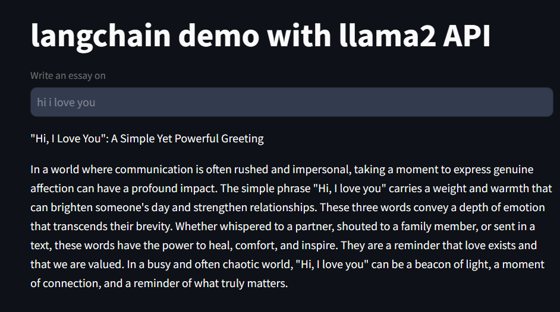

# Langchainbot 💙😊🐦
End to End LangChain Project using entire LangChain ecosystem

In this repo I discuss about building a Langchain RAG Pipeline using all the tools in Langchain ecosystem. 

Each folder is a project in itself.

Eg - in ```/api``` run the client.py as a ```streamlit``` application and app.py as a ```fastapi```  server. 
See the magic. 

